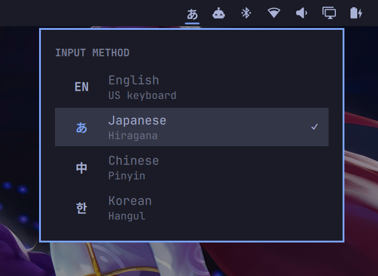

# unseencurtain.languages — CJK Input Method Switcher for Omarchy

A self-contained Omarchy bar plugin that switches the fcitx5 input method
between **English**, **Japanese** (Mozc), **Chinese** (Pinyin), and **Korean**
(Hangul) from a dropdown on the bar.



## Features

- One-click switching between `EN`, `あ` (Japanese), `中` (Chinese), and
  `한` (Korean) from the bar dropdown.
- **`Alt+U`** — toggle Japanese hiragana ↔ full-width katakana mode. The bar
  label shows `あ` / `ア`; the mode is synced across all monitor bars.
- **`Alt+I`** — jump back to the previously used input method, English
  included: from English it returns to the last CJK IM, from a CJK IM it
  returns to English, and between two CJK IMs it alternates.
- A glassy **candidate popup that follows your Omarchy theme** — the kanji/
  kana/hanzi popup reads its colors from the active theme and recolors
  automatically on every `omarchy theme set`.
- Shared input state across all windows — switching windows never silently
  changes your language.

## Requirements

- **Arch Linux** with **Hyprland** (current release, Lua config API) and
  **Omarchy** installed.
- The fcitx5 base packages (`fcitx5`, `fcitx5-gtk`, `fcitx5-qt`) — these ship
  with Omarchy and are *not* installed by this project.
- The installer uses `sudo`/`pkexec` to run `pacman` for the CJK input
  packages.

## Install

```bash
bash unseencurtain.languages/install.sh
```

(Or copy the folder anywhere you like and run its `install.sh`.)

The installer is idempotent and does everything:

1. Installs `fcitx5-mozc`, `fcitx5-chinese-addons`, `fcitx5-hangul`, and
   `wtype` if they are missing.
2. Configures fcitx5: English as the safe default, one shared input state
   across all windows, US layout with Caps as Escape.
3. Generates the candidate popup theme from your current Omarchy theme and
   installs a **theme-set hook** so the popup follows every theme change; adds
   the glassy blur for the popup.
4. Patches the Mozc engine's mode label `Full Katakana` → `Katakana`
   (same-length in-place binary patch, kept in step with a pristine backup;
   re-run the installer after any `fcitx5-mozc` package upgrade).
5. Adds the `Alt+U` and `Alt+I` hotkeys to `~/.config/hypr/bindings.lua`.
6. Installs and enables the plugin in the Omarchy bar and restarts the shell.
7. Verifies that every language actually switches.

## Usage

- **Switch language** — click the language item on the right side of the bar
  and pick `EN`, `あ`, `中`, or `한`.
- **`Alt+U`** (only with Japanese active) — toggles persistent katakana mode.
  While active, everything you type comes out in full-width katakana
  (e.g. `sushi` → スシ). Press again to return to hiragana.
- **`Alt+I`** — switches back to the previous input method (see above).

### Per-language tips

- **Japanese (Mozc):** `F6` converts the word being composed to hiragana,
  `F7` to full-width katakana, `F8` to half-width katakana. `Alt+U` is a
  persistent mode that applies to everything you type afterward.
- **Korean (Hangul):** Hanja conversion is disabled by default. To enable it,
  set `HanjaMode=True` in `~/.config/fcitx5/conf/hangul.conf`.
- **Chinese (Pinyin):** simplified/traditional and full/half-width punctuation
  are config-level fcitx5 options.

### Notes

- The candidate popup only appears while you are composing a word (1–2 letters
  in) and closes when it commits — that is normal IME behavior.
- The popup recolors itself to match your active Omarchy theme; switch themes
  with `omarchy theme set <name>` and it follows automatically.
- Language switches apply ~200 ms after the dropdown closes, so they always
  hit the app you are about to type in.

## Uninstall

```bash
bash unseencurtain.languages/remove.sh
```

`remove.sh` removes every system trace:

- deletes the plugin from `~/.config/omarchy/plugins/` and its bar entry
- restores the original unpatched Mozc engine binary from the backup
- strips the `Alt+U` and `Alt+I` hotkeys and the popup blur block from Hyprland
- removes the candidate popup theme, its theme-set hook, and the classic UI
  config
- resets the fcitx5 profile to English-only and removes the plugin's fcitx5
  configs
- removes the `fcitx5-mozc`, `fcitx5-chinese-addons`, and `fcitx5-hangul`
  packages (and unused dependencies)

It intentionally leaves the `unseencurtain.languages` folder itself and `wtype`
installed. It does **not** remove the fcitx5 base packages that Omarchy
provides.

## What this project changes on your system

| File | Change | On uninstall |
| --- | --- | --- |
| `~/.config/omarchy/plugins/unseencurtain.languages/` | Installed plugin copy | Deleted |
| `~/.config/omarchy/shell.json` | Adds `unseencurtain.languages` to the right bar | Entry removed |
| `~/.config/fcitx5/profile` | IM list: us, mozc, pinyin, hangul | Reset to English-only |
| `~/.config/fcitx5/config` | `ShareInputState=All`, `ActiveByDefault=False` | Deleted |
| `~/.config/fcitx5/conf/classicui.conf` | Popup theme (`Theme=active`) + fonts | Deleted |
| `~/.local/share/fcitx5/themes/active/` | Candidate popup theme, generated from the active Omarchy theme | Deleted |
| `~/.config/omarchy/hooks/theme-set.d/fcitx-theme-gen.sh` | Re-generates the popup theme on every theme change | Deleted |
| `~/.config/hypr/bindings.lua` | Appends `Alt+U` and `Alt+I` binds | Lines removed |
| `~/.config/hypr/looknfeel.lua` | Appends `decoration.blur.input_methods` for the popup | Block removed |
| `~/.config/hypr/input.lua` | `kb_layout = "us"`, `caps:escape` | Rewritten to the same |
| `/usr/lib/fcitx5/fcitx5-mozc.so` | Mode label `Full Katakana` → `Katakana` (in-place, same length) | Restored from backup |
| `~/.local/state/unseencurtain.languages/` | Kana mode, last-IM, and Mozc backup state files | Deleted |

## Troubleshooting

- **The hotkeys do nothing.** `Alt+U` only acts when Japanese is the active
  input method; `Alt+I` is a no-op until you have used at least two different
  input methods. Press them while a real window is focused (not the bar).
- **Language changes when switching windows.** Delete `~/.config/fcitx5/config`
  to restore fcitx5's default per-window behavior.
- **The popup is not blurred.** The glass effect needs
  `decoration:blur:enabled = true` in your Hyprland config; the theme colors
  still apply without it.
- **The mode popup says "Full Katakana" again.** A `fcitx5-mozc` package
  upgrade replaced the patched engine; re-run `install.sh` to re-apply the
  label patch.

## License

MIT — use, modify, and share freely.
